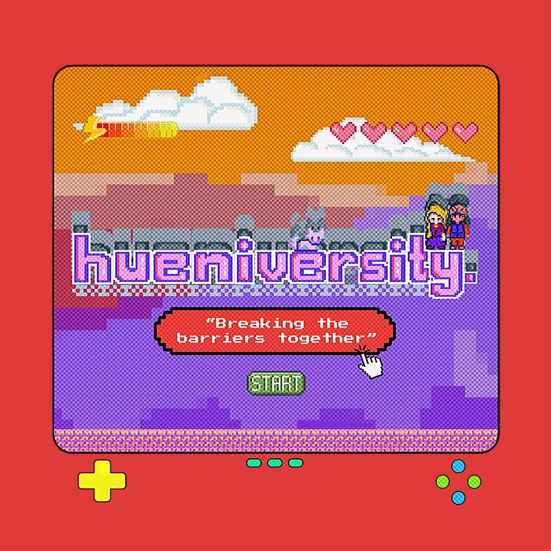

<!DOCTYPE html>
<html lang="en">
  <head>
    <meta charset="UTF-8" />
    <meta name="viewport" content="width=device-width, initial-scale=1.0" />
    <title>Document</title>
    <link rel="stylesheet" href="style.css" />
  </head>
  <body>
    <nav>
      
hueniversity.

      

        <a href="/">Home</a> <a href="/">About</a> <a href="/">Contact</a>
      

    </nav>
    <section class="hero">
      

        

          <h1>hueniversity.</h1>
          

            "Breaking the barriers"
        

        

            Do you agree with gender equality? If yes, then welcome to our page, hueniversity.
        

            

                And if you want to have knowledge about gender equality, 
                then this page 
                will help you grow your knowledge and awareness
            

          
 Gender equality means that the rights, responsibilities, and opportunities of individuals will not depend on whether they are male or female, handicapped or able-bodied, young or elderly, white or black, or from rural or urban settings. Women are entitled to live in dignity, safety, and security. 

            
 Gender equality means that men and women have equal power and equal opportunities for financial independence, education, and personal development. 

            
 Gender equality can refer to equal opportunities or formal equality based on gender or refer to equal representation or equality of outcomes for gender, also called substantive equality. 

            
 Gender equity is the process of being fair to women and men. To ensure fairness, strategies, and measures must often be available to compensate for women’s historical and social disadvantages that prevent women and men from otherwise operating on a level playing field. Equity leads to equality.
              Gender equality requires equal enjoyment by women and men of socially valued goods, opportunities, resources, and rewards. 

          <button>Know More</button>
        

        

          
        

      

    </section>
  </body>
</html>
